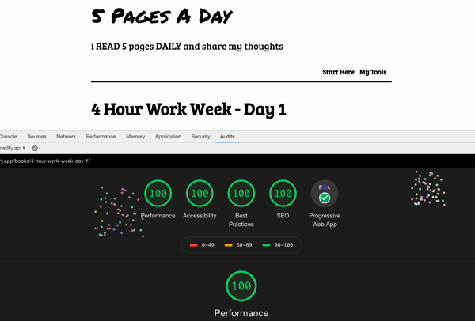

> “And so I just kept writing to myself.” ― Kimberly Novosel, Loved

Morning Pages is a theme for static site generator [GoHugo](https://gohugo.io/).

If you want to form daily habits like journaling, reading, writing, blogging, then Morning Pages theme inspires you to write and acts as your accountability partner.

Morning pages theme provides the following features:

 - Speed, what speed? Breakneck Speed!
 - Valid PWA out of the box.
 - Automatic structured data.
 - SEO optimized.
 - Featherweight.
 - Netlify functions.
 - Seamless integration with Google Books API.
 - Product Showcase box.
 - Series taxonomy is inbuilt.
 - Syntax highlighting.
 - Example site included.
 - Kitchen sink included.

Lighthouse v5 theme results:



## ❯ Installation

You can use the `exampleSite` provided to bootstrap your new project:

```sh
git clone https://github.com/scriptstar/morning-pages morningpages

mkdir -p new-site/themes/morningpages

mv morningpages/exampleSite/* new-site
mv morningpages/* new-site/themes/morningpages

cd new-site

hugo serve
```

## ❯ Kitchen sink

You can check out all the components of this theme [here](https://5pagesaday.com/kitchen-sink/) and a fully functional website using this theme here => [5 Pages A Day](https://5pagesaday.com).

## ❯ Configuration

```toml
baseURL = "https://example.com"
languageCode = "en-us"
theme = "MorningPages"

title = "Morning Pages"
description = "Journaling is like whispering to one's self and listening at the same time."

DefaultContentLanguage = "en"
pygmentsUseClasses = true

disableKinds = ["section", "taxonomyTerm", "pages"]

googleAnalytics = "UA-XXXXXXXXX-X"

# Enable JUST series taxonomy
[taxonomies]
  series = "series"

# Forcing slug to appear after the books
[permalinks]
  books = "/books/:slug/"

[author]
  name = "Your name"
  shortname = "scriptstar"
  homepage = "https://twitter.com/scriptstar/"

[params]
mainSections = ["books"]

headTitle = "Morning Pages"
description = "Journaling is like whispering to one's self and listening at the same time."
tagline = "I #journal 3 positive things, every day"

# Setup a netlify account to make this work.
# Look implementation deatials inside themes readme.md file
bookAPI = "https://example.com/.netlify/functions/getBookDetails"

extraHead = ''
postFooterContent = ''
postHeaderContent = ''

themeColor = "#fff" # Theme color displayed on mobile browsers

facebookSite = ""
twitterSite = ""
socialProfiles = [""]

alternatePageName = "Morning Pages"
organizationLogo = "/logo.png"
organizationName = "5PagesADay.com"

publisherName = "Morning Pages"
publisherLogo = "/logo.png"
publisherLogoWidth = 600
publisherLogoHeight = 60

[[params.headerPage]]
name = "Start Here"
link = "start"

[[params.headerPage]]
name = "My Tools"
link = "resources"

[[params.socials]]
name = "Who Am I?"
link = "http://twitter.com/scriptstar"

[[params.socials]]
name = "Subscribe"
link = "https://sendfox.com/naren"

[[params.socials]]
name = "RSS"
link = "/index.xml"

[markup]
  defaultMarkdownHandler = "blackfriday"
```

## ❯ Contributing to MorningPages

If you have a feature request or have found a bug feel free to open a new issue.

